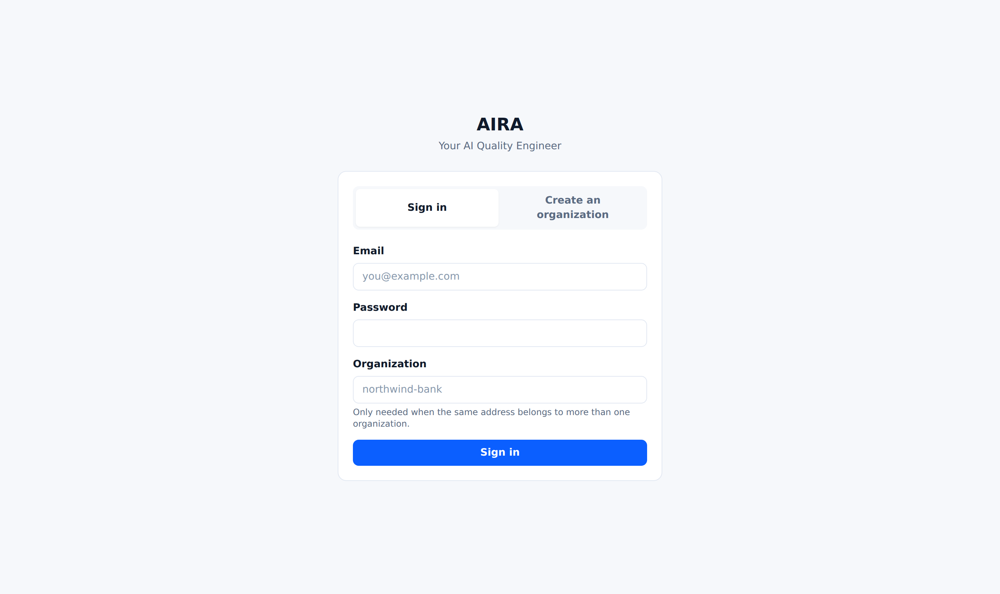
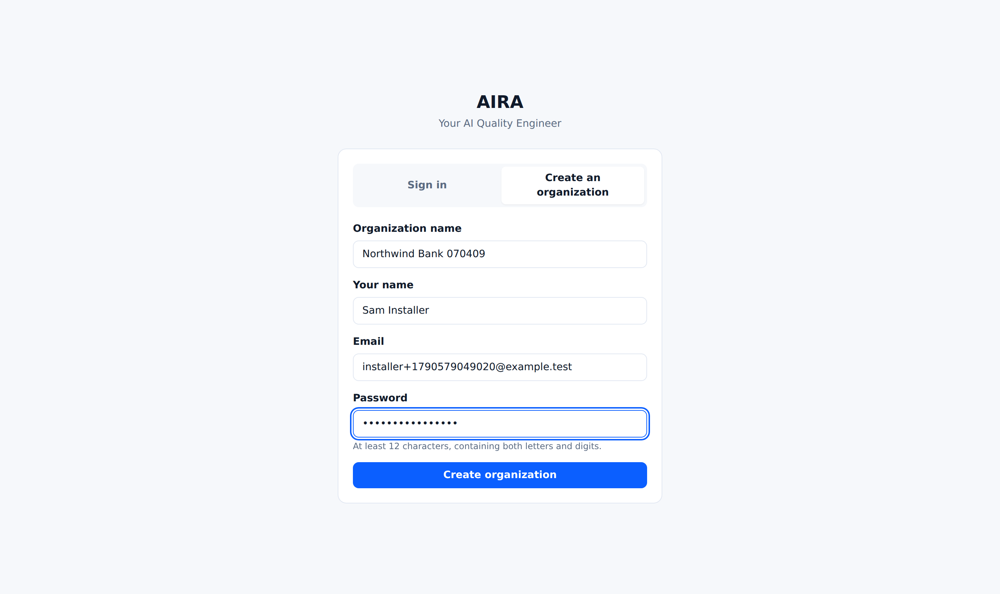
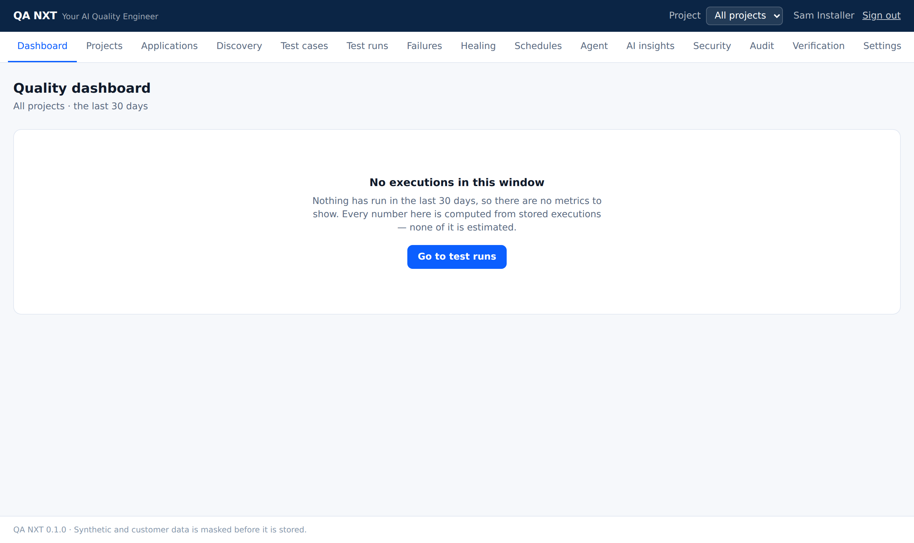
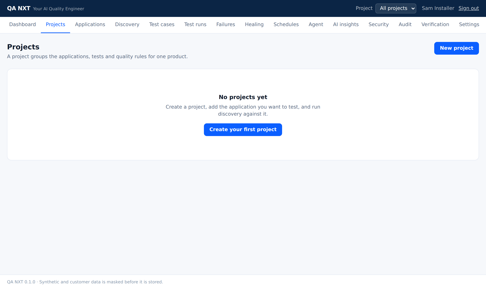
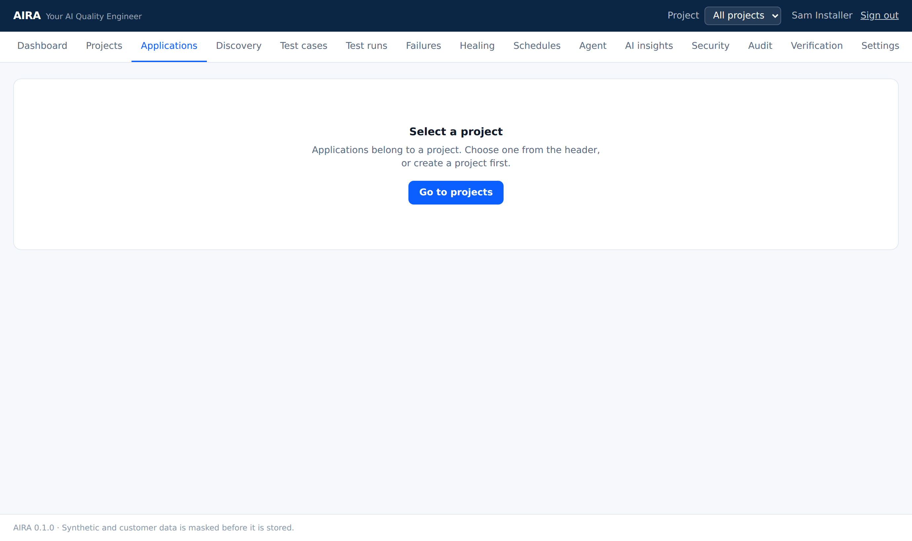
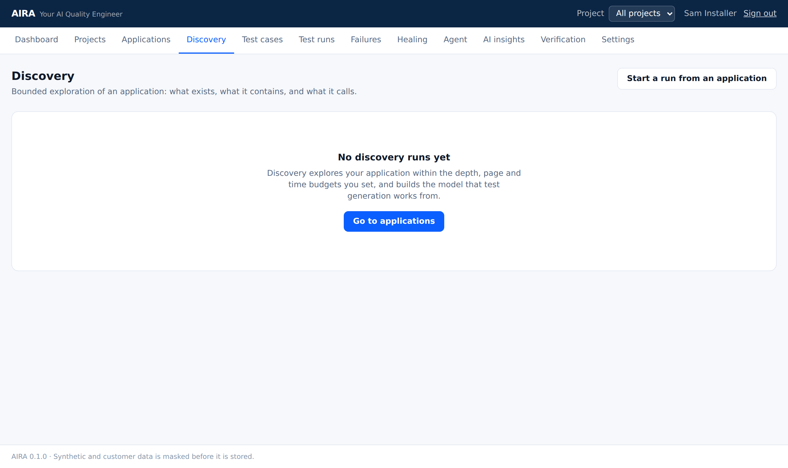
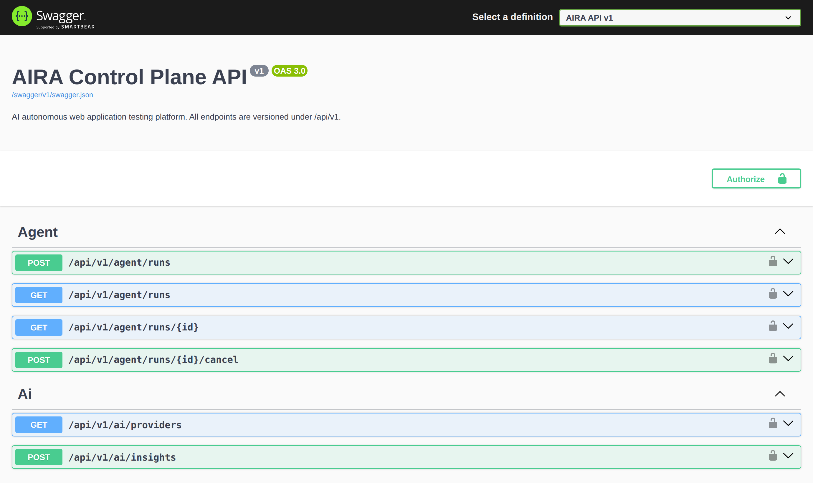
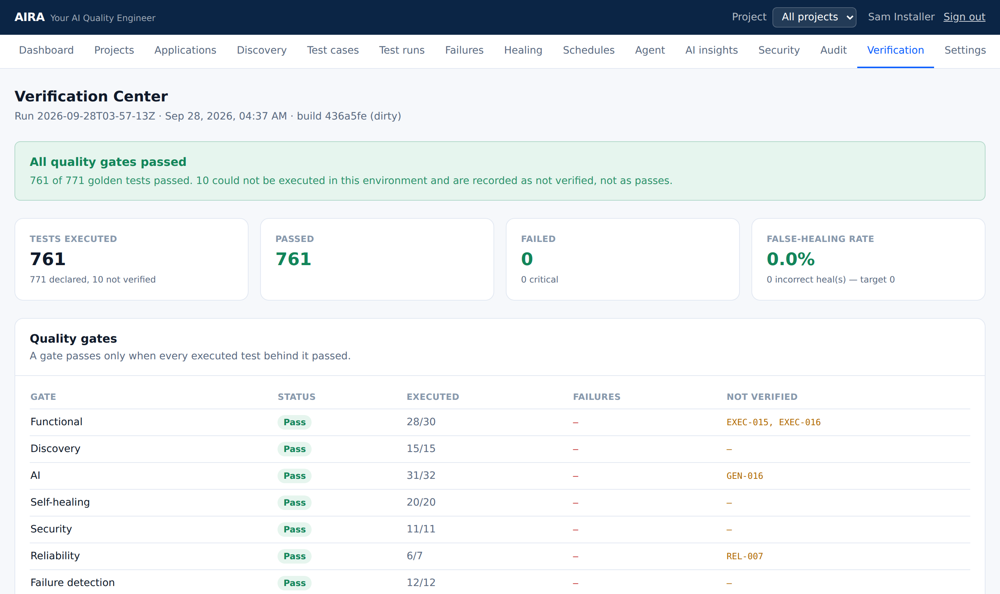

# Installing QA NXT

A complete, follow-along installation guide for **Windows**, **macOS** and **Linux**.

It assumes nothing. If you have never installed a .NET application or used Docker, start at
[Before you begin](#1-before-you-begin) and work down; every command is written out in full
and every screen you should see along the way is shown.

**If you read nothing else:** on Windows, use WSL2 or Docker Desktop. The platform's helper
scripts are bash, and there is no PowerShell equivalent — [why, and what to do
instead](#windows), below.

---

## Contents

1. [Before you begin](#1-before-you-begin) — [hardware](#hardware-requirements) · [system](#system-requirements)
2. [Choosing how to install](#2-choosing-how-to-install)
3. [Prerequisites](#3-prerequisites) — [Windows](#windows) · [macOS](#macos) · [Linux](#linux)
4. [Path A — Docker](#4-path-a--docker)
5. [Path B — from source](#5-path-b--from-source)
6. [Your first five minutes](#6-your-first-five-minutes)
7. [Checking it really works](#7-checking-it-really-works) — [per-area gates](#4-one-area-at-a-time)
8. [Settings worth knowing](#8-settings-worth-knowing)
9. [When it does not work](#9-when-it-does-not-work)
10. [Running it again, updating, resetting, removing](#10-running-it-again-updating-resetting-removing)
11. [What was verified, and where](#11-what-was-verified-and-where)

---

## 1. Before you begin

### What you are installing

QA NXT is not a single program. Installing it starts five things that talk to each other:

| Part | What it does | Where it listens |
| --- | --- | --- |
| **Console** | The web interface you use | `http://localhost:5173` |
| **API** | The control plane: projects, tests, evidence, permissions | `http://localhost:5080` |
| **Browser worker** | Drives a real Chromium browser and runs the tests | no public port (health on `9091`) |
| **PostgreSQL 16** | Everything the platform remembers | `localhost:5432` |
| **Redis 7** | The queue the API hands work to workers through | `localhost:6379` |

A sixth, the **demo bank** on `http://localhost:4200`, is a small application to point QA NXT
at so you have something to test on the first day.

### Hardware requirements

| | Minimum | Comfortable | Why |
| --- | --- | --- | --- |
| Memory | 8 GB | 16 GB | Each browser the worker opens wants about 1 GB. The API, PostgreSQL and Redis together sit under 1 GB at rest. |
| Free disk | 10 GB | 20 GB | Browsers and container images are most of it; after that it is the video, traces and screenshots every run leaves behind. |
| CPU | 2 cores | 4 cores | One core is enough to run the platform. Browsers are what use the rest. |
| Architecture | 64-bit | — | x86-64 and ARM64 both. Apple Silicon and Intel Macs both work. |
| Network | During installation | — | To download the toolchain and a browser. QA NXT does not need the internet to run afterwards unless you configure a hosted model provider. |

**If you intend to run the verification suites**, budget more: they start the platform, six
test-lab applications and nine deliberately vulnerable ones, and drive real browsers against
them. 16 GB of memory, 30 GB of free disk and 4 cores is the comfortable floor for those, and
they are not needed to use the product.

### System requirements

| | Supported | Notes |
| --- | --- | --- |
| **Linux** | Ubuntu 22.04+, Debian 12+, or any distribution with the toolchain below | What this was developed and verified on |
| **macOS** | 13 Ventura or later | Apple Silicon and Intel |
| **Windows** | 10 version 2004 or later, or Windows 11 | Through **WSL2**. There is no native Windows path; [§3](#windows) sets WSL2 up. |
| **Browser for the console** | Any current Chromium-based browser, Firefox or Safari | This is the browser *you* use. The browser the worker drives is separate and installed for you. |

Docker (Path A) needs only Docker and Git. From source (Path B) you also need the .NET SDK,
Node, pnpm, PostgreSQL and Redis — the versions are in [§3](#3-prerequisites).

### Nothing here needs administrator rights afterwards

Installing the toolchain does. Running QA NXT does not, and it binds only to `localhost` — no
part of it is reachable from your network unless you deliberately change that.

---

## 2. Choosing how to install

| | **Path A — Docker** | **Path B — from source** |
| --- | --- | --- |
| You want to | try it, or run it | change the code |
| You install | Docker only | .NET 8, Node 22, pnpm, PostgreSQL client |
| Time | 10–20 minutes, mostly downloading | 15–30 minutes |
| Works on | Windows, macOS, Linux | macOS, Linux, Windows **via WSL2** |
| Verified end to end in this repository | **partly** — see [§11](#11-what-was-verified-and-where) | **yes**, on Linux |

Pick **A** if you just want to see it work. Pick **B** if you intend to run the test suites,
the golden suite, or change anything.

---

## 3. Prerequisites

### Windows

**Read this part before installing anything.**

QA NXT's helper commands (`make setup`, `make dev`, `scripts/*.sh`) are bash scripts. There is
no PowerShell or `cmd` equivalent in the repository, and pretending otherwise would waste
your afternoon. You have two supported routes:

- **WSL2** — a real Ubuntu inside Windows. Everything in this guide then works exactly as
  it does on Linux. **Recommended.**
- **Docker Desktop** — Path A only, driven from PowerShell with `docker compose` directly
  rather than `make`.

#### Setting up WSL2

Open **PowerShell as Administrator** and run:

```powershell
wsl --install -d Ubuntu-24.04
```

Restart when asked. Ubuntu opens and asks you to choose a username and password — these are
for Linux and are unrelated to your Windows account.

Check it:

```powershell
wsl --status
```

You want `Default Version: 2`. If it says 1:

```powershell
wsl --set-default-version 2
wsl --set-version Ubuntu-24.04 2
```

From here on, **open the Ubuntu terminal** and follow the [Linux](#linux) instructions
inside it. Two things to know:

- Keep the repository in the Linux filesystem (`~/qanxt`), not under `/mnt/c/`. Building
  across the Windows/Linux boundary is several times slower.
- Reach the console from Windows at `http://localhost:5173` as normal — WSL2 forwards it.

#### If you would rather use Docker Desktop

Install **Docker Desktop for Windows** from <https://docs.docker.com/desktop/install/windows-install/>,
enable the WSL2 backend when the installer offers it, then confirm in PowerShell:

```powershell
docker --version
docker compose version
```

Then follow [Path A](#4-path-a--docker), using the PowerShell commands given there.

---

### macOS

Install [Homebrew](https://brew.sh) if you do not have it:

```bash
/bin/bash -c "$(curl -fsSL https://raw.githubusercontent.com/Homebrew/install/HEAD/install.sh)"
```

**Then put it on your PATH.** The installer does not do this for you; it prints a "Next
steps" block asking you to, and it is the step people miss. Without it every `brew`
command below fails with `brew: command not found`, because Apple Silicon installs
Homebrew in `/opt/homebrew`, which no shell looks in by default:

```bash
echo >> ~/.zprofile
echo 'eval "$(/opt/homebrew/bin/brew shellenv)"' >> ~/.zprofile
eval "$(/opt/homebrew/bin/brew shellenv)"
```

On an Intel Mac the path is `/usr/local/bin/brew`. Check it took:

```bash
brew --version
```

Then, for **Path A**:

```bash
brew install --cask docker
open -a Docker          # start it once, and let it finish starting
```

For **Path B**:

```bash
brew install node@22 postgresql@16 redis git
brew link --force --overwrite node@22   # node@22 is keg-only, so --force is required
npm install -g pnpm                     # Homebrew's node does not reliably ship corepack
brew services start postgresql@16
brew services start redis
```

`npm install -g pnpm` rather than `corepack enable`: Homebrew's node formula has not
carried corepack dependably, so that command tends to fail with `corepack: command not
found` and leave you without pnpm. npm is bundled, so this route works either way. If you
prefer corepack and your install has it, `corepack enable` does the same job.

**Put the PostgreSQL client tools on your PATH.** `postgresql@16` is keg-only too, so
`brew install` leaves `psql` and `createdb` where no shell will find them. The server
still starts, because `brew services` uses absolute paths — which is why this shows up
later as a missing `psql` rather than a database that will not run:

```bash
echo "export PATH=\"$(brew --prefix postgresql@16)/bin:\$PATH\"" >> ~/.zprofile
export PATH="$(brew --prefix postgresql@16)/bin:$PATH"
```

**The .NET SDK needs care, and Homebrew is not the way to get it.** The `dotnet-sdk` cask
tracks whatever .NET is current, which is no longer 8. This project targets `net8.0` and
pins nothing, so a newer SDK will build it and then `make dev` fails at run time with
`framework 'Microsoft.NETCore.App' version '8.0.x' not found`, because an SDK does not
carry older runtimes.

Install .NET 8 from [Microsoft's .NET 8 page](https://dotnet.microsoft.com/download/dotnet/8.0):
take **SDK 8.0.x → macOS → Arm64** on Apple Silicon, or **x64** on an Intel Mac. Picking
x64 on Apple Silicon works but runs everything under Rosetta. The `.pkg` installs to
`/usr/local/share/dotnet`.

**Then put it on your PATH yourself.** The installer is supposed to symlink
`/usr/local/bin/dotnet` and does not always do so on Apple Silicon, which leaves `dotnet`
reporting `command not found` immediately after a successful install. Setting the path
explicitly works either way:

```bash
echo 'export PATH="/usr/local/share/dotnet:$PATH"' >> ~/.zprofile
echo 'export DOTNET_ROOT="/usr/local/share/dotnet"' >> ~/.zprofile
export PATH="/usr/local/share/dotnet:$PATH"
export DOTNET_ROOT="/usr/local/share/dotnet"
dotnet --list-sdks
```

One other thing can produce the same message: zsh caches where commands live and will not
notice a new binary in a directory it has already searched. `rehash`, or a new terminal,
clears that. To tell the two apart, look on disk first:

```bash
ls -l /usr/local/share/dotnet/dotnet /usr/local/bin/dotnet 2>&1
```

Present but not found means PATH or the cache. Absent means the installer did not run.

Apple Silicon needs nothing extra beyond the PATH steps above; both .NET and Node ship
native arm64 builds.

Confirm. This reports every tool at once rather than stopping at the first missing one,
because finding them one failed command at a time is the thing `make setup` goes out of
its way to avoid:

```bash
for t in dotnet node pnpm psql; do
  printf '%-8s %s\n' "$t" "$(command -v $t || echo 'MISSING')"
done
```

Anything `MISSING` is either not installed or not on your PATH; the two PATH steps above
cover Homebrew itself and the PostgreSQL client. Then check the SDK list:

```bash
dotnet --list-sdks
```

You want an `8.0.x` line. `--list-sdks` rather than `--version`, because `--version`
prints only the one SDK it selected and reads healthy while 8.x is absent. If there is no
`8.0.x`, the API will not run.

---

### Linux

Debian and Ubuntu:

```bash
sudo apt-get update
sudo apt-get install -y git curl ca-certificates build-essential \
                        postgresql-16 postgresql-client-16 redis-server

# .NET 8 SDK
sudo apt-get install -y dotnet-sdk-8.0

# Node 22 (NodeSource)
curl -fsSL https://deb.nodesource.com/setup_22.x | sudo -E bash -
sudo apt-get install -y nodejs
sudo corepack enable                  # provides pnpm

sudo systemctl enable --now postgresql redis-server
```

Fedora and RHEL:

```bash
sudo dnf install -y git dotnet-sdk-8.0 nodejs postgresql16-server postgresql16 redis
sudo corepack enable
sudo systemctl enable --now postgresql redis
```

For **Path A** instead, install Docker Engine by following
<https://docs.docker.com/engine/install/> for your distribution, then:

```bash
sudo usermod -aG docker "$USER"      # so you need not sudo every command
newgrp docker
```

#### Versions this was verified against

| Tool | Verified | Minimum |
| --- | --- | --- |
| .NET SDK | 8.0.131 | 8.0 |
| Node | 22.22.2 | 22 |
| pnpm | 10.33.0 | 10 |
| PostgreSQL | 16.13 | 16 |
| Redis | 7.0.15 | 7 |
| Docker | 29.3.1 | 24 |
| Git | 2.43.0 | 2.30 |

---

## 4. Path A — Docker

### Get the code

```bash
git clone <this repository> qanxt
cd qanxt
```

PowerShell is the same, without `sudo` anywhere.

### Create the configuration

```bash
cp .env.example .env
```

Now put three secrets in `.env`. **Generate them — do not invent them, and do not reuse the
placeholders.** The API refuses to start with the shipped values, because a platform that
boots with a known signing key is not secured by anything.

macOS, Linux, WSL2:

```bash
openssl rand -base64 48    # paste as JWT_SECRET
openssl rand -base64 32    # paste as ENCRYPTION_KEY   (must decode to exactly 32 bytes)
openssl rand -base64 32    # paste as WORKER_TOKEN
```

Windows PowerShell:

```powershell
$b = New-Object byte[] 48; [Security.Cryptography.RandomNumberGenerator]::Fill($b)
[Convert]::ToBase64String($b)                       # JWT_SECRET
$b = New-Object byte[] 32; [Security.Cryptography.RandomNumberGenerator]::Fill($b)
[Convert]::ToBase64String($b)                       # ENCRYPTION_KEY
$b = New-Object byte[] 32; [Security.Cryptography.RandomNumberGenerator]::Fill($b)
[Convert]::ToBase64String($b)                       # WORKER_TOKEN
```

Open `.env` in any editor and replace the three `CHANGE_ME…` lines.

### Start it

macOS, Linux, WSL2:

```bash
make docker-up
```

Windows PowerShell — `make` is not available, so run what `make` would:

```powershell
docker compose -f infrastructure/docker/docker-compose.yml --project-directory . up --build -d
```

> The `--project-directory .` matters. Compose reads `.env` from beside the compose file
> unless told otherwise, and without it none of your secrets resolve and the stack fails
> with an error that does not explain why.

The first run builds six images and takes several minutes. Afterwards:

```bash
docker compose -f infrastructure/docker/docker-compose.yml --project-directory . ps
```

Every service should read `running` or `healthy`. Then open
**<http://localhost:5173>** and go to [§6](#6-your-first-five-minutes).

To stop it — `make docker-down`, or `docker compose … down`. That keeps your data.
`make docker-reset` deletes the database, the queue and every stored artifact; it is the
only command here that destroys anything.

---

## 5. Path B — from source

**The commands below are identical on macOS and Linux.** On **Windows**, run all of them
inside the Ubuntu (WSL2) terminal, where they are ordinary Linux commands.

Finish [§3](#3-prerequisites) first. `make setup` starts PostgreSQL and Redis if it can,
but it does not install them:

| | What §3 leaves you with |
| --- | --- |
| **macOS** | PostgreSQL and Redis installed by Homebrew and already running under `brew services`. |
| **Linux** | The `postgresql-16` and `redis-server` packages installed. |
| **Windows** | The Linux row, inside WSL2. |

```bash
git clone <this repository> qanxt
cd qanxt
make setup
```

The clone address is the one behind the repository's green **Code** button, ending in
`.git`. It is not the URL in your browser's address bar while you are reading the code:
anything containing `/tree/<branch>` or `/blob/` is a web page, and `git clone` will
reject it with `repository not found`. To start from a branch other than the default,
clone first and then `git checkout <branch>`.

`make setup` checks every prerequisite first and reports them together, then copies
`.env.example` to `.env`, **generates the three secrets for you**, installs dependencies,
starts PostgreSQL and Redis, and applies the database migrations.

If something is missing it stops and names it:

```
Missing prerequisites:
  - dotnet — the .NET 8 SDK (https://dotnet.microsoft.com/download)
  - pnpm — pnpm 10 or newer (npm install -g pnpm, or corepack enable)
```

Install what it names and run `make setup` again. It is safe to repeat.

`make setup` then creates the `qanxt` role and database. It reaches PostgreSQL as a
superuser in whichever way your machine allows: a direct connection when you are one
already (which is what Homebrew gives you on macOS), otherwise through the `postgres`
account with `sudo`. If it can reach neither, it stops and prints the two commands to run
yourself rather than failing on a password prompt:

```bash
psql -d postgres -c "CREATE ROLE qanxt LOGIN PASSWORD 'qanxt' CREATEDB;"
createdb -O qanxt qanxt
```

### Run it

```bash
make dev
```

This starts the API, a browser worker, the console and the demo bank together, and stops
them all on Ctrl-C. Logs go to `/tmp/qanxt-*.log`.

| | |
| --- | --- |
| Console | <http://localhost:5173> |
| API | <http://localhost:5080> |
| API reference | <http://localhost:5080/swagger> |
| Demo bank | <http://localhost:4200> |

### A browser for the worker

The worker drives a real Chromium. `pnpm install` installs the Playwright *client*, not
the browser, so on a fresh clone you have to fetch the browser yourself. Call the binary
directly:

```bash
cd apps/browser-worker
./node_modules/.bin/playwright install chromium
```

About a 150MB download, so expect a progress bar for a minute or two.

Do not route this through `pnpm --filter … exec`. It looks tidier and it hides failure:
pnpm returns exit status 0 whether the download succeeded, failed on every mirror, or
matched no package at all, so a broken install is indistinguishable from a working one.

On Linux you may also need Chromium's system libraries, which wants root:

```bash
cd apps/browser-worker
sudo ./node_modules/.bin/playwright install-deps chromium
```

Now check it. Two directories have to exist, `chromium-1194` and
`chromium_headless_shell-1194`, those being the build this repo's Playwright 1.56 pins:

```bash
ls ~/Library/Caches/ms-playwright/   # macOS
ls ~/.cache/ms-playwright/           # Linux
```

The worker launches the headless shell, so the second one is the one that matters. Files
on disk are not proof that a browser starts, though, and this is the check that is:

```bash
cd apps/browser-worker
node -e "const {chromium}=require('playwright'); chromium.launch().then(b=>b.close()).then(()=>console.log('browser OK')).catch(e=>{console.error('browser FAILED:', e.message.split('\n')[0]); process.exit(1)})"
```

`browser OK` means discovery can run. Anything else means it cannot, whatever the console
reports.

---

## 6. Your first five minutes

A fresh install has no accounts, so the console opens on a sign-in page that also offers to
create one.

### Create your organization



Choose **Create an organization**. The password must be at least 12 characters and contain
letters and digits. The account you create administers the organization — somebody has to.



Press **Create organization**. You are signed in and land on the dashboard. On a new
install it is empty, and says so rather than showing zeroes that look like measurements:



**If you got this far, the installation worked.** The console is talking to the API, the API
is talking to PostgreSQL, and your account was created and signed in. Everything below is
using the product rather than installing it.

### Create a project

**Projects → New project.** The key (`BANK`, say) is what the CLI and every test reference
use, so keep it short.



### Register something to test

**Applications → Add an application.** Point it at `http://localhost:4200/dashboard` and
give it the demo bank's credentials — username `alice`, password `Password123!`. They are
encrypted before they are stored and never come back out of the API.



### Discover it

**Discovery → run it** against the application. It crawls within the bounds you set and
builds the model everything else works from.



From there: **Test cases → Generate** writes tests from the model, and **Test runs → New
run** executes them in a real browser and keeps the screenshots, video, trace and network
log of each one.

**[The user manual](user-manual.md)** takes it from here, screen by screen.

---

## 7. Checking it really works

Three checks, in increasing order of thoroughness.

### 1. The API answers

Open **<http://localhost:5080/swagger>**. You should see the API's own reference:



Or from a terminal:

```bash
curl http://localhost:5080/health      # → Healthy
```

### 2. The test suites pass

Path B only — this needs the source and the toolchain.

```bash
make test
```

Runs every suite that does not need a browser: **885 unit tests**, **57 integration tests**
against a real PostgreSQL, and **262 Node tests** across the browser worker, the CLI, the
browser extension, the console and the shared types. All of them should pass.

### 3. The whole product, proved against a test lab

```bash
./scripts/verify-product
```

This is the serious one and takes about 25 minutes. It starts the infrastructure, builds and
starts six purpose-built applications, audits their ground truth, runs the product's own
tests, runs all **34 golden suites** against them, then writes the reports and the
certification. It exits 0 only if every quality gate passes.

On the machine this guide was written on, that is **761 of 771 golden tests passed, 0 failed,
10 not verified**, every quality gate green, and a certification answering YES to all ten of
its questions. The suites grow, so treat the count as the shape of the answer rather than a
number to match; the report it writes states the day's.

The console shows the result at **Verification**:



Yours will differ as the suites grow. What should match is that no quality gate is red, and
that whatever could not run is counted as **not verified** rather than folded into the pass
total.

Ten tests read **not verified** rather than passed on a machine like this one, and each says
why in its own words:

| | Why it could not run |
| --- | --- |
| `EXEC-015`, `EXEC-016` | Firefox and WebKit are not installed here and could not be downloaded. |
| `GEN-016` | No model provider is configured, so generation quality cannot be judged. |
| `REL-007` | This deployment reconciles stranded executions after ten minutes — longer than the suite is willing to wait. |
| `SECN-001`, `SECW-N001` | Production security testing is off by default and there is no production environment to point at. |
| `SECN-002`, `SECN-003`, `SECW-N002`, `SECW-N003` | Covered elsewhere, or not measurable here — each names what covers it instead. |

That is the intended behaviour, and it is the whole point of the distinction: **a test that
could not run is never counted as one that passed.** A suite that reported these ten as passes
would be claiming things about browsers it never opened.

### 4. One area at a time

`verify-product` covers everything. When you only want to prove one area — or when you are
changing one and want the fast answer — each has its own gate, and each writes its own report
and exits non-zero if a requirement it claims is not verified by a test that actually ran.

```bash
./scripts/verify-continuous-quality   # CI, contracts, schedules, gates, accessibility, visual
./scripts/verify-security             # the security engine against the vulnerable labs
./scripts/verify-autonomous-qa        # the autonomous agent, end to end
```

Each is also a `make` target: `make verify-continuous-quality`, `make verify-security`,
`make verify-autonomous-qa`. `make help` lists all of them.

`verify-autonomous-qa` takes about 10 minutes and finishes with a line worth reading:

```
271 passed, 0 failed, 0 not verified of 271 golden tests
Requirements: 30 verified, 0 failed, 0 not verified, 0 not tested
```

The second line is the one that matters. A requirement no passing test covers is reported as
**not tested** and fails the gate, rather than being quietly absent from a green summary.

---

## 8. Settings worth knowing

Everything is set through `.env`, and `.env.example` documents every value. These four
change behaviour most:

| Setting | Default | What it does |
| --- | --- | --- |
| `AI_DEFAULT_PROVIDER` | `local` | `local` uses the built-in deterministic engines and needs no API key. Set `openai`, `anthropic` or `gemini` with the matching key to use a hosted model. Every result says which produced it. |
| `ALLOW_PRIVATE_NETWORK_TARGETS` | `true` | Lets the platform reach `localhost`, which the demo bank needs. **Turn this off for any deployment reachable from a network** — it is what the SSRF guard otherwise prevents. |
| `WORKER_CONCURRENCY` | `2` | How many executions one worker runs at once. Each browser wants about a gigabyte. |
| `LOG_LEVEL` | `Information` | Turn up to diagnose, down to quieten. |

### Using a hosted model

Not required. With `AI_DEFAULT_PROVIDER=local`, QA NXT generates tests and analyses failures
with built-in deterministic rules, and labels every result as such. To use a model instead,
set the provider and its key in `.env` and restart:

```bash
AI_DEFAULT_PROVIDER=anthropic
ANTHROPIC_API_KEY=sk-ant-…
```

---

## 9. When it does not work

**`http://localhost:5080/` shows a 404.** Expected. The API has no page at its root; it
serves `/swagger`, `/health` and `/api/v1/...`. Nothing is wrong.

**Discovery sits on `Running` and never finishes.** The worker took the job and could not
finish it. `tail -40 /tmp/qanxt-worker.log` says why. The usual cause on a new machine is
a missing browser, logged as `Executable doesn't exist at …`; fix it with the steps under
"A browser for the worker" in section 5. The worker releases a failed job back to the
queue, so a permanently broken browser gives you a run that retries forever and a status
that reads `Running` with nothing behind it.

**`playwright install chromium` appears to do nothing.** If you ran it as
`pnpm --filter @qa-nxt/browser-worker exec playwright install chromium`, silence tells you
nothing: that form exits 0 on success, on a failed download, and on a filter that matched
no package. Run `./node_modules/.bin/playwright install chromium` from
`apps/browser-worker` instead and read the exit status, then run the launch check in
section 5.

**`make dev` says `No rule to make target 'dev'`.** You are not in the clone. `make`
reads the `Makefile` in the current directory, and a prompt of `~ %` means your home
directory, which has none. `cd` to the directory you cloned into and run it again. Every
`make` command in this guide is run from the repository root.

**`make dev` stops with `Error 127` just after the worker starts (macOS).** 127 is
"command not found", and the command was `setsid`, which the console's start script used
to detach the dev server. setsid is util-linux and does not exist on macOS. Fixed; update
your clone.

**`make dev` fails at the browser worker with dozens of `Cannot find module
'@qa-nxt/shared-types'` errors.** The workspace libraries have not been built. `dist/` is
gitignored and `pnpm install` only links the package, so a clone that has not been
through a current `make setup` has nothing for the worker's compiler to read. Every other
error in that wall cascades from this one. Fix it with:

```bash
pnpm --filter "./packages/**" build
```

`make setup` now does this for you; this is only needed on a clone set up before it did.

**`git clone` says `repository not found` for a URL you copied from GitHub.** You have
copied a web page address. Clone URLs come from the **Code** button and end in `.git`;
anything with `/tree/<branch>` or `/blob/` in it is the page you were reading. Clone the
repository, then `git checkout <branch>`.

**`brew: command not found`, right after installing Homebrew (macOS).** The installer does
not add itself to your PATH; it prints a "Next steps" block asking you to. Run the
`brew shellenv` lines in [macOS](#macos). This also explains a `command not found` for
anything Homebrew installed afterwards.

**`pnpm: command not found` after `corepack enable` (macOS).** Homebrew's node has not
dependably included corepack. Use `npm install -g pnpm` instead; npm is bundled.

**`psql: command not found`, but PostgreSQL is running (macOS).** `postgresql@16` is
keg-only, so the client tools are not on your PATH even though `brew services` started
the server. `make setup` needs `psql` and will stop without it. See [macOS](#macos).

**`dotnet: command not found` right after installing the .pkg (macOS).** Two causes, and
`ls -l /usr/local/share/dotnet/dotnet /usr/local/bin/dotnet` tells them apart. If the
first exists and the second does not, the installer skipped the symlink, which it does
sometimes on Apple Silicon: add `/usr/local/share/dotnet` to your PATH, as
[macOS](#macos) shows. If both exist, it is zsh's command cache — run `rehash` or open a
new terminal. If neither exists, the installer has not run.

**`dotnet` runs but the API exits with `framework 'Microsoft.NETCore.App' version '8.0.x'
not found`.** You have a .NET SDK, but not .NET 8, and an SDK does not carry older
runtimes. `dotnet --list-sdks` will show no `8.0.x` line. See [macOS](#macos).

**`make` is not recognised (Windows).** Expected — see [Windows](#windows). Use WSL2, or
Docker Desktop with the `docker compose` commands written out in [Path A](#4-path-a--docker).

**The API exits saying `JWT_SECRET must be at least 32 characters`.** The three secrets are
still the placeholders. The Docker path does not generate them for you; go back to
[Create the configuration](#create-the-configuration).

**`make docker-up` fails with a missing variable.** Compose is reading `.env` from the wrong
place. Pass `--project-directory .`, exactly as the commands above do.

**Port 5173 or 5080 is already in use.** Something else has it. Find it, or change
`API_PORT` and `CONSOLE_PORT` in `.env` and restart.

*macOS / Linux / WSL2:*

```bash
lsof -i :5173
```

*Windows PowerShell:*

```powershell
Get-NetTCPConnection -LocalPort 5173 | Select-Object OwningProcess
```

**`make setup` cannot reach PostgreSQL.** The server is installed but not running.

```bash
sudo systemctl status postgresql       # Linux
brew services list                     # macOS
```

**Discovery finds nothing, or a run reports `blocked`.** The target is outside the
application's allowed domains, or it is a private address and
`ALLOW_PRIVATE_NETWORK_TARGETS` is off. The refusal names the reason, and the run says
`blocked` rather than `failed` because the test never ran — that is not a defect in the
application under test.

**Everything is `blocked` and no worker appears.** `WORKER_TOKEN` differs between the API
and the worker, or the worker cannot reach Redis. `curl localhost:9091/health` tells you
which.

**`Executable doesn't exist at …` when a run starts.** The worker's browser was never
downloaded — see [A browser for the worker](#a-browser-for-the-worker).

**A package restore fails inside a Docker build with a certificate error.** You are behind a
TLS-inspecting proxy. Put its CA certificate in `infrastructure/docker/certs/` and pass the
proxy as a build argument; [deployment](deployment.md) has the commands.

**The database is in a state you want rid of.**

```bash
make db-reset
```

It drops, recreates and re-migrates. It refuses to run against anything that is not a local
host, and asks for the database name first.

---

## 10. Running it again, updating, resetting, removing

**Start it again in a new terminal.** `make dev` runs the four processes in the
foreground and stops them all on Ctrl-C, so they live exactly as long as the terminal you
started them from. Closing that window stops the product. To bring it back:

```bash
cd <the directory you cloned into>
make dev
```

From the repository root, always. `make` has no rule to offer anywhere else.

Nothing is lost when you stop it. Your projects, applications, runs and evidence are in
PostgreSQL, which Homebrew or systemd keeps running independently. You do not need
`make setup` again unless you pulled new code.

**Update:**

```bash
git pull
make setup          # re-installs dependencies and applies any new migrations
```

Under Docker, `make docker-up` rebuilds changed images.

**Reset the data but keep the installation:** `make db-reset`, or `make docker-reset` for
the Docker path.

**Remove it completely:** stop the stack, delete the directory you cloned into, and — if you
used Docker — `docker compose … down -v` to delete its volumes. The toolchain you installed
in [§3](#3-prerequisites) is ordinary software; remove it the way you would anything else.

---

## 11. What was verified, and where

This section exists because a guide that has not been followed is a guess, and you deserve
to know which parts of this one are which.

### The screenshots

Every screenshot in this guide is of the real product, captured from a real browser driving
a real installation by `test-lab/scripts/capture-install-screenshots.mjs`, which walks the
same path §6 asks you to walk. Nothing is drawn, mocked or staged. You can regenerate them
all with:

```bash
node test-lab/scripts/capture-install-screenshots.mjs
```

**There are no screenshots of the Windows or macOS installers**, because those steps could
not be run here to photograph them. Rather than illustrate this guide with pictures of
something nobody checked, it links to each vendor's own instructions.

### Verified

| | Where |
| --- | --- |
| Path B, end to end, including `make setup`, `make dev`, `make test` and `./scripts/verify-product` | **Linux** (Ubuntu 24.04, x86-64) |
| The first-run path in §6 — organization, project, application, discovery | Linux, in a real Chromium |
| `make test` — 885 unit, 57 integration, 262 Node tests | Linux |
| `./scripts/verify-product` — 761 of 771 golden tests, 10 not verified, every gate green, CERTIFIED | Linux |
| `./scripts/verify-autonomous-qa` — 271 golden tests, 30 of 30 requirements, exit 0 | Linux |
| `./scripts/verify-security` and `./scripts/verify-continuous-quality` | Linux |
| **§3 macOS prerequisites, on a real Apple Silicon Mac** — Homebrew on PATH, node@22, pnpm, postgresql@16, redis, and .NET 8 SDK 8.0.425, ending with all four tools resolving | macOS 15, Apple Silicon. Walked by a reader, who found six defects in §3 doing it: no Homebrew PATH step, `brew link` missing `--force`, the `dotnet-sdk` cask not being .NET 8, postgresql@16 keg-only so no `psql`, `corepack enable` not working on Homebrew's node, and the .NET installer not creating `/usr/local/bin/dotnet`. All six are fixed above. |
| **`make setup`, end to end, on a real Apple Silicon Mac** — prerequisites checked, `.env` written with generated secrets, `pnpm install`, `dotnet restore`, Homebrew's PostgreSQL and Redis started, the `qanxt` role and database created, migrations applied | macOS 15, Apple Silicon. The first time `make setup` has run on macOS. It exercises the Homebrew branch of `scripts/services-ctl.sh` and its `direct` superuser path, both of which had only been proven by simulation on Linux before this. |
| `make setup` reaching PostgreSQL as a superuser **three ways** — a direct connection as the current user (the shape Homebrew gives macOS, reproduced here with a superuser role), `su` as root, and `sudo -u postgres` as an ordinary user — plus the refusal message when none is available | Linux. The direct path was proven by reproducing a Mac's privilege shape, not on a Mac. |

### Not verified

| | Why |
| --- | --- |
| **The minimum hardware column** in §1 | Nobody has run QA NXT on 8 GB and 2 cores. Those figures are derived from what the parts actually consume, not measured on such a machine. The comfortable column is what this was developed and verified on. |
| Any step on **Windows** | Not available here. The prerequisites are the ones the code actually requires and the commands are the vendors' documented ones, but nobody has walked them. Treat §3 for Windows as carefully-derived rather than tested. |
| **macOS** beyond `make setup` | §3 and `make setup` have now been walked on an Apple Silicon Mac (see Verified). `make dev`, the first-run path in §6, `make test` and the verification scripts have not. |
| **Path A end to end** | Two of the four images build and run here; the console and demo-bank images could not be built in this environment because the image registry they need is unreachable, so the full compose stack has never been started in one piece. `docs/verification-status.md` has the detail. |
| **WSL2** | The Linux instructions are what WSL2 runs, and nothing in them depends on the kernel, but the WSL2 route itself has not been walked. |

If you hit something this guide gets wrong, that is a defect in the guide. The most useful
thing you can do is say exactly which command you ran and what it printed.
