# AIRA user manual

How to use the platform, screen by screen.

This assumes AIRA is installed and running. If it is not, start with
**[the installation guide](installation.md)**.

Every screenshot here is of the real product, holding real results. They were captured by
driving a live installation, not assembled by hand — see
[About these screenshots](#about-these-screenshots) at the end.

---

## Contents

1. [What AIRA does](#1-what-aira-does)
2. [Getting around](#2-getting-around)
3. [Setting up a workspace](#3-setting-up-a-workspace)
4. [Discovery: teaching AIRA the application](#4-discovery-teaching-aira-the-application)
5. [Getting tests](#5-getting-tests)
6. [Running tests](#6-running-tests)
7. [Reading a result](#7-reading-a-result)
8. [When a test fails](#8-when-a-test-fails)
9. [When the application changes: self-healing](#9-when-the-application-changes-self-healing)
10. [Security testing](#10-security-testing)
11. [The autonomous agent](#11-the-autonomous-agent)
12. [Asking questions](#12-asking-questions)
13. [The Verification Center](#13-the-verification-center)
14. [Settings: people, providers and quality gates](#14-settings-people-providers-and-quality-gates)
15. [Running from a pipeline](#15-running-from-a-pipeline)
16. [Glossary](#16-glossary)
17. [What AIRA will not do](#17-what-aira-will-not-do)

---

## 1. What AIRA does

AIRA tests a web application by driving a real browser, and keeps the evidence.

The loop it runs, and which section of this manual covers each part:

```
   Register an application  ──▶  Discover it        ──▶  Get tests        ──▶  Run them
        (§3)                       (§4)                    (§5)                 (§6)
                                                                                  │
   Approve or reject a repair ◀──  Understand why  ◀──  Read the evidence  ◀──────┘
        (§9)                          (§8)                  (§7)
```

The same application model also feeds **security testing** (§10) — once somebody has authorized
it in writing, which is the one part of the product that starts switched off.

Two ideas run through all of it, and the product is easier to use if you know them:

- **A pass means it ran.** The action executed, the expected behaviour was observed, the
  assertion held, and there is evidence. AIRA would rather tell you it could not check
  something than tell you it passed.
- **Nothing changes itself without asking.** The agent proposes; a repaired locator is a
  suggestion until you approve it; the platform never edits your tests behind your back.

A third applies wherever security is involved: **untested is not the same as clean**, and AIRA
reports the difference rather than rounding it down to a green tick.

---

## 2. Getting around

Sign in at `http://localhost:5173`.

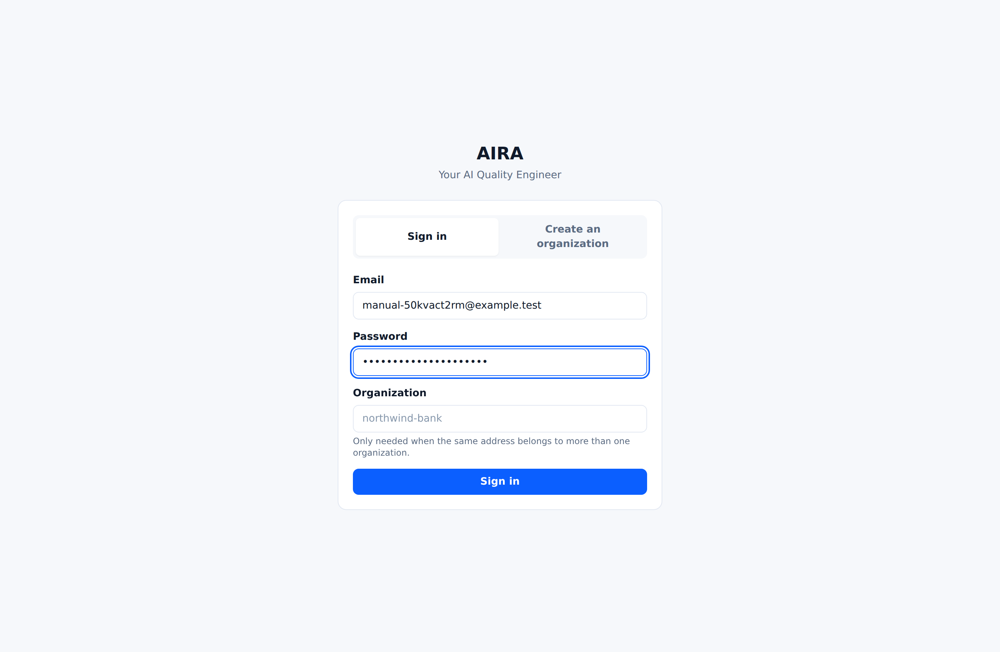

Once you are in, two controls in the top bar matter more than anything else:

| | |
| --- | --- |
| **Project** | Almost every page shows one project at a time. If a page looks empty, check this first. |
| Your name / **Sign out** | Your account and role live under **Settings**. |

The **dashboard** is the landing page. It computes everything from stored executions — there
are no estimates on it — and says so plainly when nothing has run yet.

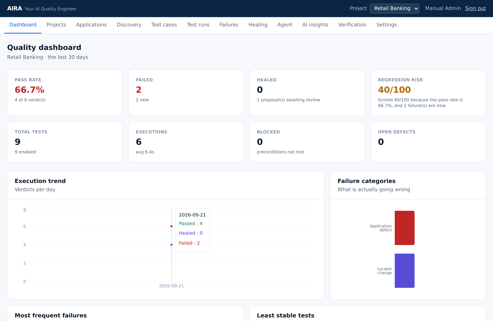

---

## 3. Setting up a workspace

### Create a project

**Projects → New project.** A project groups applications, tests and runs, and carries
settings such as the healing policy and what evidence to capture.

The **key** you choose (`BANK`, `RETAIL`) appears in every test reference and in the CLI, so
keep it short.

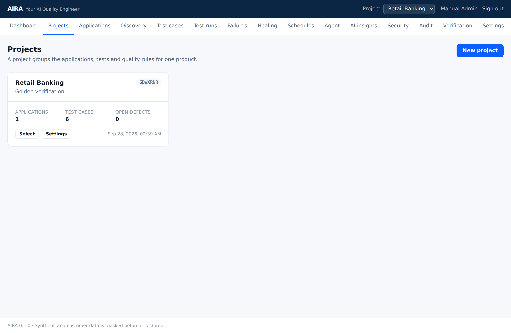

### Register the application under test

**Applications → Add an application.**

| Field | What to put in it |
| --- | --- |
| **Name** | What your team calls it. |
| **Base URL** | Where the crawl starts. **Point this at a page behind the sign-in**, such as `/dashboard` — see the warning below. |
| **Login URL** | The sign-in page. |
| **Credentials** | A test account. Encrypted before storage; the API never returns them, and a password typed during a run is stored as `***REDACTED***`. |
| **Allowed domains** | Where AIRA may go. Anything else is refused, and a test that tries is reported `blocked` rather than failed. |

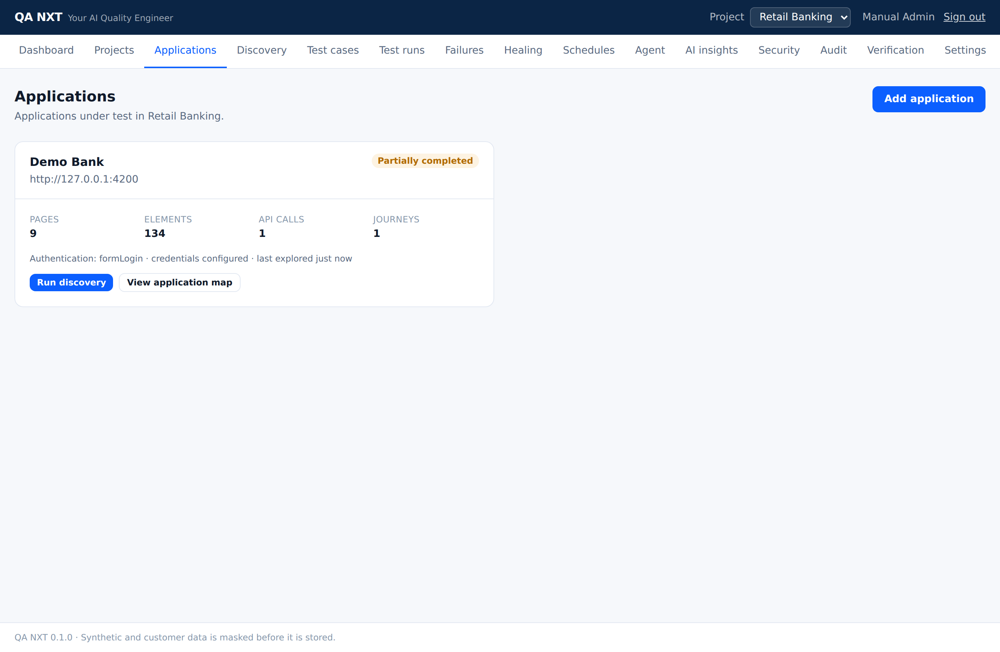

> **Choose the base URL with care.** AIRA crawls outward from it. If the root of your
> application bounces every visitor to the sign-in page, a crawl starting there can reach
> exactly one page — and discovery will report "completed" while it does it. Give it a page
> a signed-in user would land on.

---

## 4. Discovery: teaching AIRA the application

Everything downstream works from a model of your application, and discovery is what builds
it. **Discovery → run it** against an application.

AIRA signs in with the credentials you stored, crawls within the bounds you set, and records
each page, the elements on it, how pages link to each other, and the API calls the pages make
while it drives them.

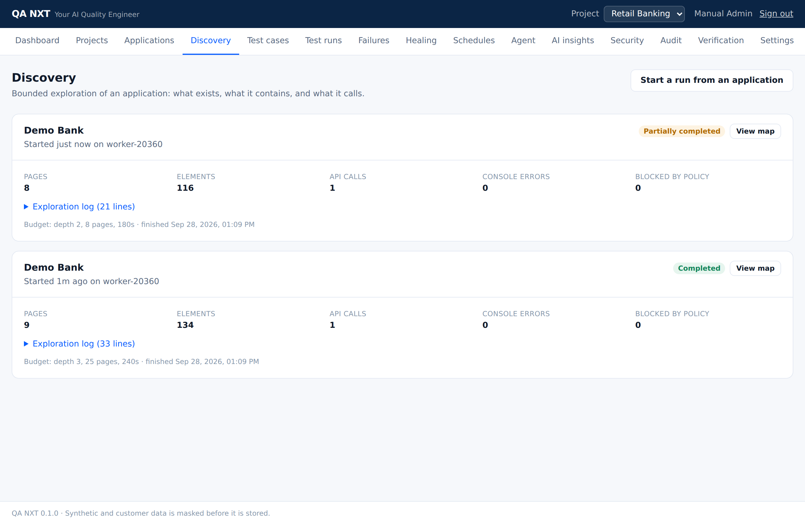

Open the model from **Applications → (your application) → map**:

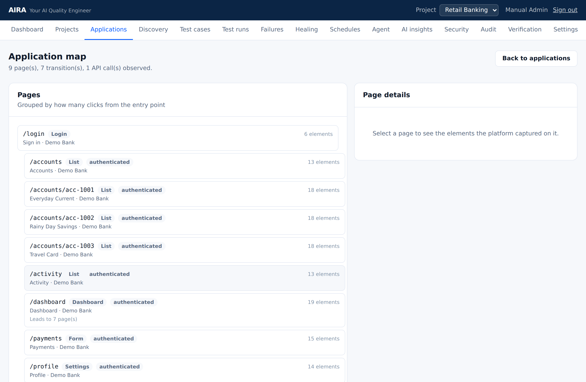

Worth understanding here:

- **Pages are grouped by how many clicks they are from the entry point.** Depth is what the
  crawl bounds limit.
- **Each page has a kind** — login, list, form, dashboard, settings. The test generator uses
  this to decide what kind of test is worth writing.
- **`authenticated`** marks pages only reachable when signed in.
- **Elements carry a preferred locator** — a test id, a role and name, or a label — rather
  than a position in the page structure. This is what makes a test survive a redesign, and
  what self-healing later reasons about.

Re-run discovery whenever the application changes shape. It does not overwrite your tests.

---

## 5. Getting tests

Two ways in, and they coexist.

### Generate them from a requirement

**Test cases → Generate.** Write the requirement in plain English — *"Customer can sign in
and view their account balance"* — and AIRA plans tests against the model discovery built.

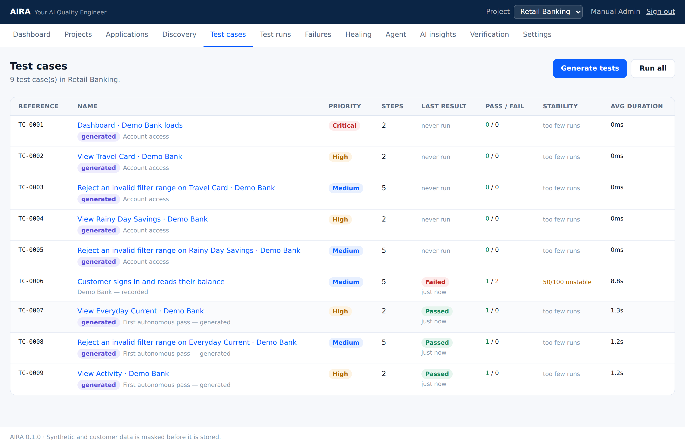

Open one to see exactly what it will do. A generated test is not a black box: every step
names its action, its target and its expectation, and you can edit it.

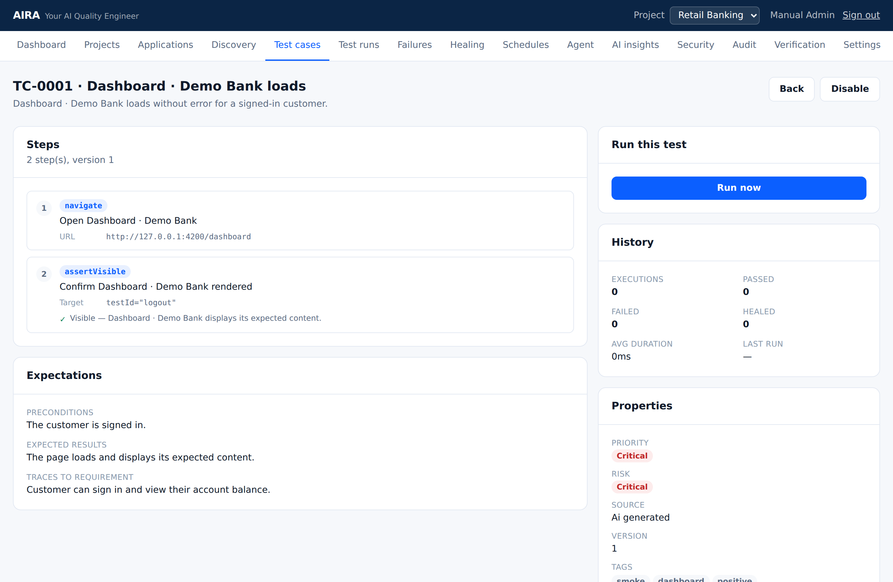

> **Read generated tests before you trust them.** They are a first draft written from the
> model, not from your intent. Where AIRA cannot tell what a success looks like, it says so
> in the expected result rather than inventing an assertion — a test that cannot fail is
> worse than no test.

**With no model provider configured**, generation uses AIRA's built-in deterministic rules,
and every result is labelled as such. To use a hosted model instead, see
[§14](#14-settings-people-providers-and-quality-gates).

### Record a journey

Drive the application yourself with the browser extension and import what you did. This is
the right tool when the test is *"the thing our customers actually do"* rather than something
derivable from the page structure.

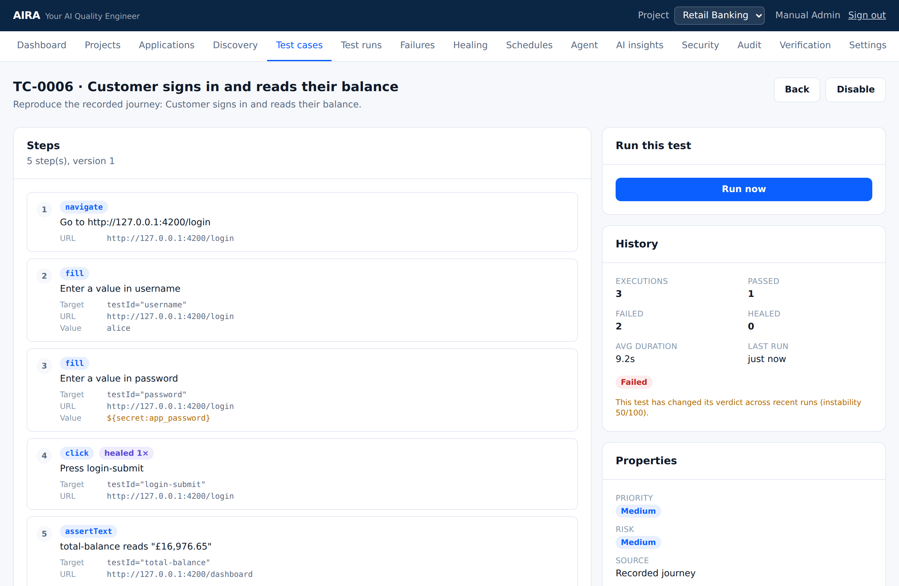

A recorded password is never stored as text — it becomes a `${secret:…}` reference resolved
at run time.

---

## 6. Running tests

**Test runs → New run.** Choose the tests, the browser, and how many retries to allow.

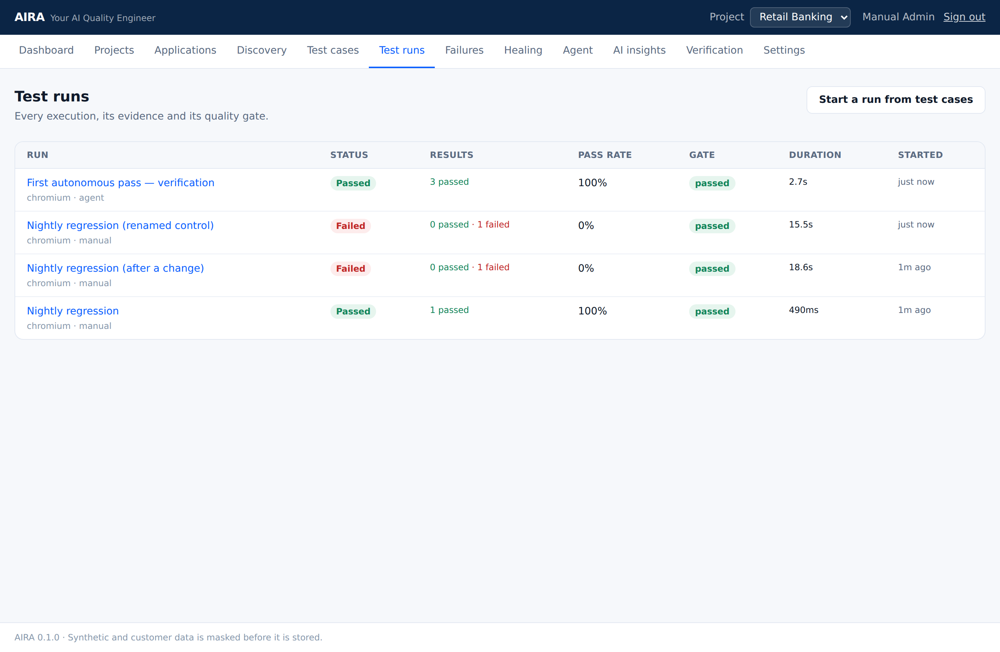

Open a run to see its totals, the quality-gate verdict, and every test in it:

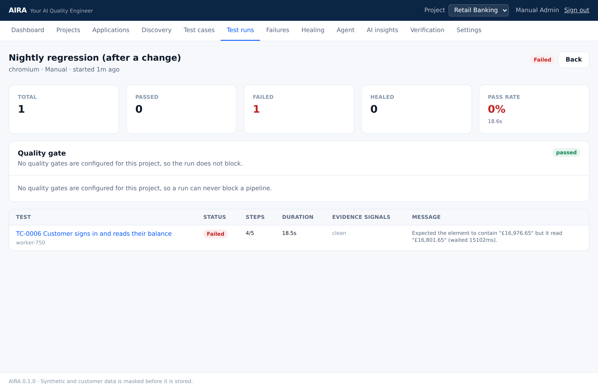

A run executes each test in a real browser on a worker. While it runs, the page updates
itself — you do not need to reload to find out it finished.

Note the **Healed** count beside **Passed**: a run that needed a repair is counted apart
from one that did not. Note too that the quality gate reports *passed* here while the run
failed — because no gates are configured, and the page says exactly that rather than
implying the run met a standard nobody set. Gates are covered in
[§14](#14-settings-people-providers-and-quality-gates).

Each run reports one of:

| Verdict | What it means |
| --- | --- |
| **Passed** | Every step ran and every assertion held. |
| **Healed** | It passed, but a locator had to be repaired to get there. Deliberately *not* reported as a clean pass. |
| **Failed** | A step or assertion did not hold. |
| **Blocked** | The test never ran — bad credentials, or a target outside the allowed domains. Not an application defect, and counted separately. |

---

## 7. Reading a result

Open a run, then an execution inside it. This is the screen you will spend the most time on.

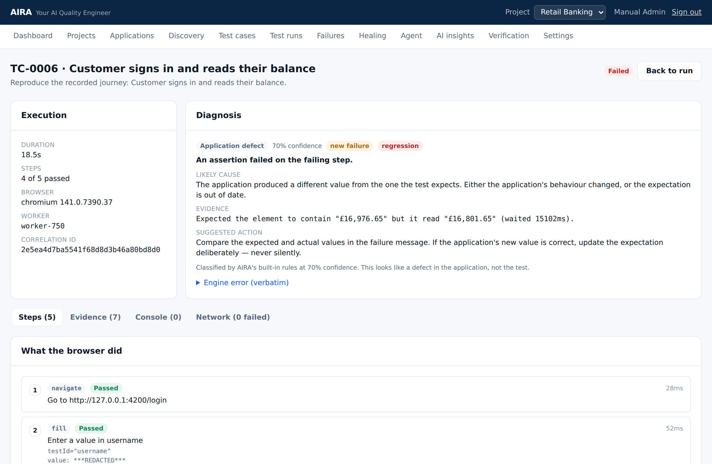

It has four parts:

1. **Execution** — duration, how many steps passed, which browser and version, which worker,
   and a correlation id that ties this run to the server logs.
2. **Diagnosis** — what kind of problem this is, how confident AIRA is, and what it suggests
   you do. Covered in [§8](#8-when-a-test-fails).
3. **The tabs** — **Steps**, **Evidence**, **Console**, **Network**.
4. **What the browser did** — every step with its action, target, duration and outcome.

Under **Evidence** you will find what was captured while the test ran: screenshots (including
one at the moment of failure), a video, a Playwright trace you can replay step by step, a DOM
snapshot, the accessibility tree, and the console and network logs.

Note the password in the step list reads `***REDACTED***`. It is redacted at capture, not
hidden at display — the real value never reaches storage.

---

## 8. When a test fails

A red test is a question: *is the application broken, or is the test?* The **Failures** page
exists to answer it quickly.

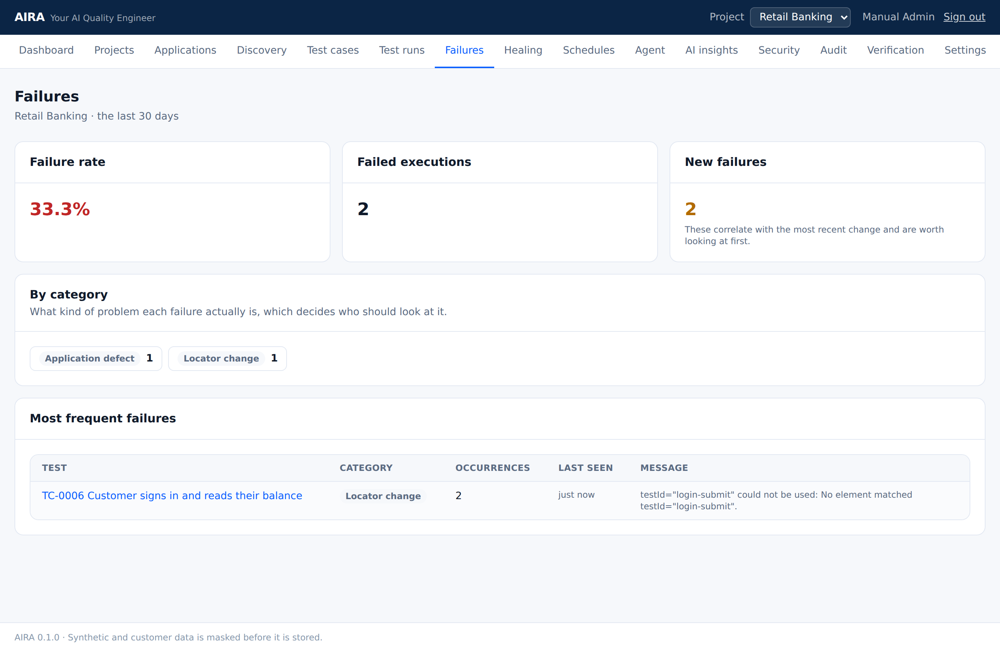

- **New failures** are the ones that correlate with the most recent change. Start here.
- **By category** is the useful cut: it tells you *who should look at this*.

| Category | Usually means |
| --- | --- |
| **Application defect** | The application did something wrong. A developer's problem. |
| **Locator change** | The element moved or was renamed. Often self-healable — see [§9](#9-when-the-application-changes-self-healing). |
| **Test defect** | The test is ambiguous or wrong. Yours to fix. |
| **Environment defect** | It never ran — credentials, or the environment was unreachable. Says nothing about the application. |
| **Network issue** / **Timing issue** | A request failed at the network layer, or something was slower than the test allowed. |

Every analysis names what produced it. With no model provider configured it reads
*"Classified by AIRA's built-in rules"* with a confidence — it never implies a model looked
at something a rule decided.

**An analysis never changes a verdict.** It explains a failure; it cannot turn one into a
pass.

---

## 9. When the application changes: self-healing

When a locator stops matching, AIRA looks for the element the step *meant* to reach — by
role, accessible name, text, test id, position in the page, and neighbours — and scores how
confident it is.

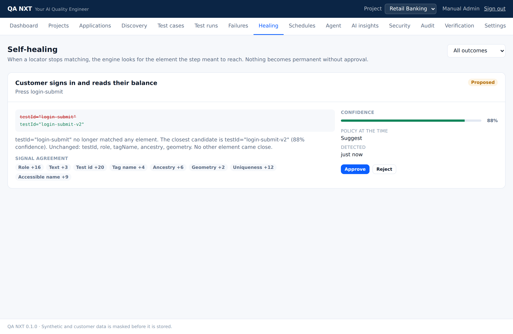

The proposal shows you everything it used to decide: the old locator, the candidate, the
confidence, and **which signals agreed and by how much**. Approve or reject it.

### The policy is yours to choose

Set it per project:

| Policy | Behaviour |
| --- | --- |
| **Never** | Never repairs. A broken locator simply fails. |
| **Suggest** *(default)* | Proposes a repair and fails the run. Nothing changes until you approve. |
| **Auto** | Applies a repair above your confidence threshold, continues the run, and reports it as **healed** — never as a clean pass. |

### What it will not do

This is the part worth trusting, and it is measured rather than asserted. When the control a
step needs **no longer exists**, or when two candidates are equally plausible, or when
something with the same label now does something different, AIRA **fails the test**. It does
not click the nearest thing that looks close enough.

The platform's own verification measures this as a **false-healing rate**, and publishes it
as a number rather than folding it into a success rate — see
[§13](#13-the-verification-center).

---

## 10. Security testing

AIRA can test an application's security as well as its behaviour. **Security** in the left-hand
nav, then pick an application at the top of the page — everything below is about that one
application.

The rules here are different from the rest of the product, because a security test sends things
at an application on purpose. Three of them are worth knowing before you start:

- **Nothing is testable until somebody authorizes it, in writing, per application.** There is
  no global switch and no "scan everything" button. That is the design, not a setup step
  somebody forgot.
- **Every default refuses.** An empty list of hosts permits nothing rather than everything; a
  rate limit of zero refuses rather than runs unthrottled.
- **A scan that did not run is never reported as a clean one.** "Queued", "abandoned" and "no
  findings" are three different states and the product keeps them apart everywhere.

Depth on any of this is in **[docs/security/](security/)**; this section is how to use it.

### Authorize the application first

The first card is **Authorization**, and until it says something nothing else on the page can
happen. It shows the application's **security scope**: the record of who authorized testing and
exactly what they authorized.

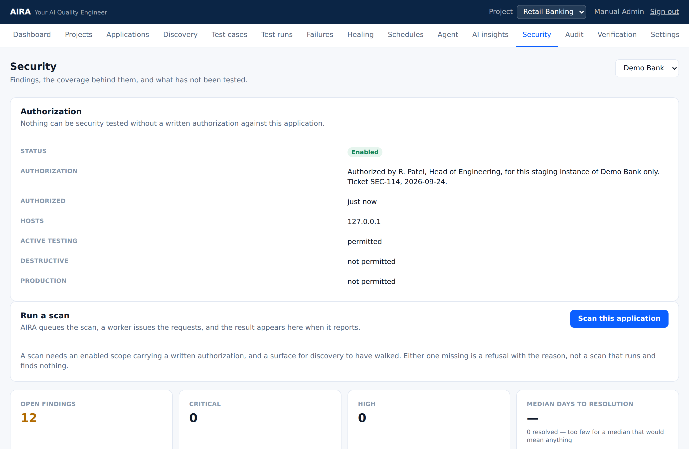

| The scope holds | |
| --- | --- |
| **Authorization** | A written note. **Required** — an empty note refuses every request. |
| **Hosts** | Where requests may go, with a separate list for API hosts when they differ. An empty list permits nothing; it does not mean "no restriction". |
| **Paths** | An optional allowlist, and a blocklist that wins over everything else. |
| **Environment** | The one environment authorized. A scan naming another is refused. |
| **Active testing** | Whether anything beyond observation may be sent. Off by default. |
| **Destructive** | Whether requests nobody can assume are reversible may be sent. Off by default. |
| **Production** | Whether production may be touched at all. Off by default. |
| **Rates** | Requests per second, concurrency, and how long a scan may run. All start at `0`, and `0` refuses. |

A scope saved without changing anything permits nothing — the right answer for a record whose
only job is to say what a person agreed to.

Writing one needs `security:authorize` (project admin and above), and today it is an API call:

```bash
curl -X PUT "$AIRA_API_URL/api/v1/security/applications/$APP_ID/scope" \
  -H "authorization: Bearer $AIRA_TOKEN" -H 'content-type: application/json' \
  -d '{
    "enabled": true,
    "authorizationNote": "Authorized by R. Patel, Head of Engineering, for staging only. Ticket SEC-114, 2026-09-24.",
    "allowedDomains": "staging.bank.example.test",
    "allowedApiDomains": "api.staging.bank.example.test",
    "allowedPaths": null,
    "blockedPaths": "/admin/billing",
    "environmentId": null,
    "maxRequestsPerSecond": 5,
    "maxConcurrentRequests": 2,
    "maxScanDurationMinutes": 20,
    "allowActiveTesting": true,
    "allowDestructiveTesting": false,
    "allowProduction": false
  }'
```

**The console displays the scope; it has no editor for it.** That is a gap rather than a
principle, and it is worth knowing before you go hunting for the button.

The note is the part that matters. "Authorized" with no name, no date and no boundary is the
paperwork without the decision, and it is the first thing anyone will ask to see if a scan ever
causes a problem.

### Run a scan

**Run a scan → Scan this application.** It needs `security:scan`, and the card is absent
without it. AIRA queues a job, a worker issues the requests, and the result appears on this page
when the worker reports. The button runs the **standard** profile; the other profiles, and
narrowing a scan to particular checks, come from the CLI or the API.

Four things are settled before the job exists, and each one **refuses** rather than quietly
running something smaller:

| Refused when | Because |
| --- | --- |
| The application has no enabled scope carrying a written note | Nothing may be tested without somebody saying so |
| The scope permits destructive testing and you lack `security:scan:destructive` | Both are required, and neither grants the other |
| The environment is production and you lack `security:production` | Production security testing is off by default |
| Discovery has never walked the application | A scan with no targets issues no requests, and would still be stored as a scan — which reads as a clean result |

> **A queued scan is not a result.** While it waits, the card says so in as many words: nothing
> about this application's security has been established by queueing it. The gate on that scan
> reads `NOT SCANNED`, and the CLI exits `7`. "A scan has been queued" and "this build has been
> security tested" are different statements, and only one of them is true at that point.

If no worker ever reports, AIRA stops waiting and marks the scan **abandoned**, with the reason
on the card. That is a platform problem — go and look at your workers — and it is deliberately
not a finding about the application, and never a pass.

#### Profiles

A profile bounds what a scan will attempt *regardless of what the scope permits*. It is the
promise made to whoever approved it.

| Profile | Passive | Active | State-changing | Destructive |
| --- | --- | --- | --- | --- |
| `passive` | yes | — | — | — |
| `standard` | yes | yes | yes | — |
| `regression` | yes | yes | yes | — |
| `deep` | yes | yes | yes | yes |

Both the profile and the scope are consulted and both must permit. A `deep` scan against a scope
that forbids destructive testing still refuses the destructive requests. `regression` runs only
the checks derived from findings already confirmed on this application — the fast one for a
pipeline, once a baseline exists.

### Reading the page

Under the scan card, four things, in the order the page shows them.

**The counters** — open findings, Critical, High, and the median days to resolution. All
computed from stored findings; where there is nothing to compute from they show `—` rather than
a zero, because a zero reads as good news.

**Latest scan** carries the gate's verdict and every rule behind it, each marked passed, failed
or **not measured**. A threshold compared against a value nobody measured reads as a guarantee
and is not one, so the page says which it was.

**Trend** draws one bar per scan, labelled with the coverage it was measured at — `7/15 checks`
— and a scan the API could not compare to the one before it is drawn **hollow and marked "not
comparable"**. Narrowing a scan makes findings fall, and a solid falling bar would read as
progress when it is the opposite.

**Attack surface** is what discovery walked, what each part of it implies, and — printed *above*
the list, deliberately — what this does not cover. Anywhere discovery never reached is untested,
not clean, and a reader who takes the list as complete would conclude the opposite.

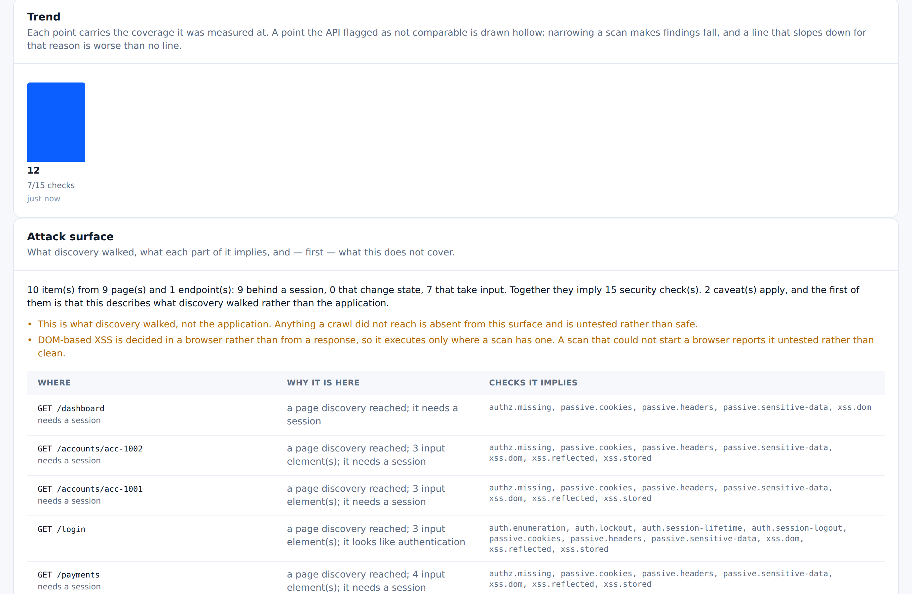

### Findings

The **Findings** table lists what the scans found, filterable by status. Each row carries the
severity, the finding and its CWE, where it was observed, its status and when it was last seen.

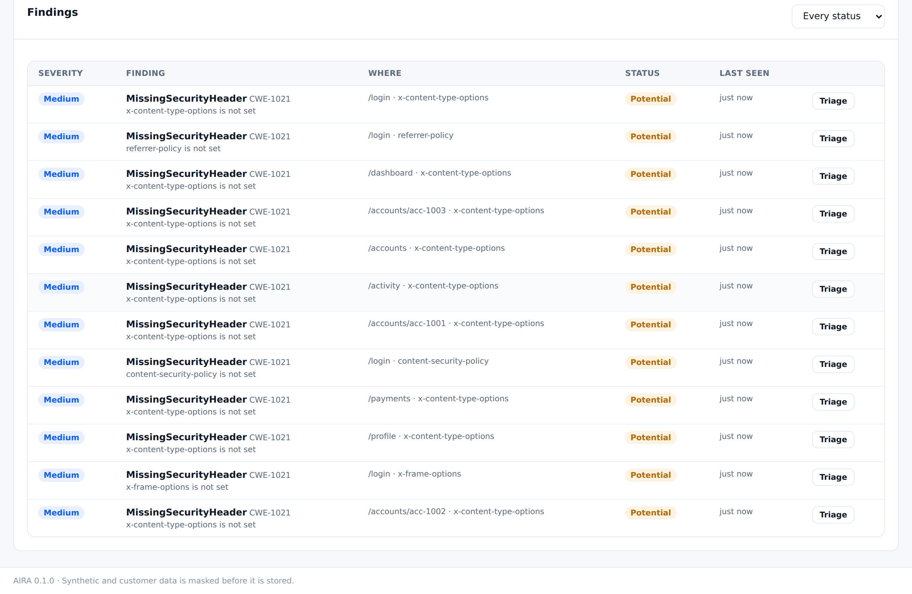

**Severity is computed, never assigned** — not by a person and not by a model. Five stored
factors, fixed weights, out of 19:

| Factor | Values | Weight |
| --- | --- | --- |
| Exploitability | theoretical → trivial | ×2 |
| Impact | minimal → severe | ×2 |
| Privilege required | administrator → none | ×1 |
| Affected data | none → credentials | ×1 |
| Exposure | internal → public | ×1 |
| Requires unusual conditions | — | −3 |

Bands: **Critical** ≥16, **High** ≥12, **Medium** ≥8, **Low** ≥4, Informational below. Every
finding stores its factors, so any number on the screen can be recomputed and argued with.

**Confidence is a separate question** and is never folded into severity: **High** means
reproduced and the evidence admits no other reading, **Medium** reproduced or corroborated
twice, **Low** a single unreproduced indicator. Hover a severity badge to see it. This is why a
new High finding fails a build but a new High at Low confidence goes to review.

Every finding carries the request and response that establish it. A finding with no exchange
behind it is **refused rather than recorded** — AIRA does not store a claim nobody can check.
Secrets are redacted before evidence is written.

### Triage

**Triage** on a finding's row, with `security:triage`. Confirm it, send it for review, or set it
aside as a false positive, an accepted risk or resolved.

Setting one aside **requires a justification of at least twenty characters**, in the form as well
as at the API, and your name is recorded against the decision. This is not bureaucracy: a
suppression with no stated reason is indistinguishable from switching the check off, and the
security gate counts it as **open** either way and fails the build on it.

Decisions append to a history rather than overwriting a field. A suppression covers *one*
finding — that endpoint, that parameter, that role — never a whole category. And a decision
carries forward to the next scan while the severity does not: something accepted at Medium that
is now Critical does not inherit the old verdict.

### The security gate

Every scan produces **PASS**, **REVIEW** or **FAIL** from rules evaluated in order:

| Rule | When it fails |
| --- | --- |
| A security scan ran | REVIEW — `NOT SCANNED` |
| At least 80% of the configured checks executed | REVIEW |
| No more than 25% of requests were refused by the scope | REVIEW |
| Every suppressed finding carries a justification and a name | **FAIL** |
| Every finding carries evidence | REVIEW |
| No previously resolved finding has come back | **FAIL** |
| No new finding at or above High | **FAIL** |
| No open finding at or above Critical | **FAIL** |

The rules that matter are the ones about absence. A build nobody scanned is REVIEW, never PASS.
A scan that ran one check out of five describes a fifth of an application. A scan whose own
scope refused most of its requests describes the part it was allowed to reach. A regression
fails at **any** severity, because something that was fixed and has come back is a different
fact from something new.

Self-healing cannot touch a security finding, and nothing automated can close one.

### Scanning on a schedule

A schedule can fire a security scan instead of a test run. It appears on **Schedules** with a
`security scan` badge, and it is created through the API today — neither the console nor
`aira schedule add` will make one:

```bash
curl -X POST "$AIRA_API_URL/api/v1/schedules" \
  -H "authorization: Bearer $AIRA_TOKEN" -H 'content-type: application/json' \
  -d '{"projectId":"'"$PROJECT_ID"'","name":"Nightly security scan",
       "cronExpression":"0 2 * * *","timeZone":"Europe/London",
       "kind":"securityScan","applicationId":"'"$APP_ID"'"}'
```

It needs `security:scan` as well as `project:write` — `project:write` alone is not a route to
recurring security scans. A scheduled scan runs under the `standard` profile: it can never be
destructive and can never touch production, because nobody is watching when it fires and the
permissions that would allow either belong to a person, not to a timer.

Withdrawing a scope stops its schedule rather than being ignored by it: the scan is refused, the
refusal is recorded, and three refusals in a row disable the schedule with the reason attached —
which is what withdrawing authorization is supposed to do. Nothing else triggers a scan; the
cron is the only trigger there is.

### What a clean result is allowed to say

This is the sentence the product will print, and the strongest one it has:

> Within the configured scope and test coverage, no security findings were detected by the
> executed AIRA security tests. This is not a statement that the application is secure or that
> no vulnerabilities exist.

It is always followed by what was **not** tested. AIRA will not say an application is secure,
will not say it has no vulnerabilities, and will not let an empty findings list stand in for
either.

### Where it does not reach

Worth reading before you rely on any of it:

- **Discovery bounds what can be tested.** An endpoint AIRA never found was never scanned. This
  is why coverage is reported as tested-versus-untested rather than as a percentage.
- **DOM-based XSS needs a browser.** A worker-run scan does it; a response-only scan reports it
  as untested rather than absent.
- **Cloud metadata and link-local addresses are refused before the allowlist is consulted**, so
  they are untested, permanently and on purpose. A scope cannot opt in.
- **Production scanning has never been exercised in its permitted form.** Every refusal path is
  verified; the allowed path is recorded as NOT VERIFIED in the security report, because no
  production environment exists to exercise it against.
- **Detection is measured against a purpose-built lab** whose flaws were written alongside the
  checks that find them. That rate describes the lab and does not generalise to your
  application.

`docs/security/limitations.md` is the full list, and it is kept current rather than aspirational.

---

## 11. The autonomous agent

**Agent → Start a pass.** The agent explores an application, scores where the risk is,
generates tests for what is not covered, runs them, and writes up what it found.

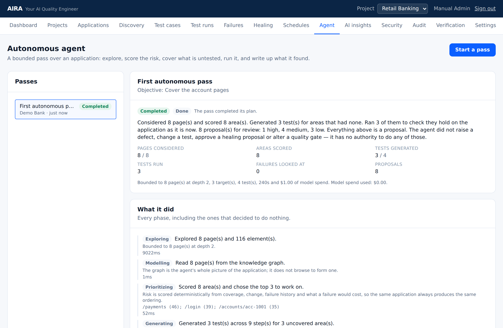

You give it bounds before it starts — pages, depth, targets, tests, a time budget and a spend
limit — and it reports against them. **It proposes; it has no authority.** It cannot raise a
defect, change a test, approve a healing proposal or alter a quality gate. The summary on
every pass says so.

**What it did** lists every phase, including the ones that decided to do nothing, with the
reasoning. Prioritisation is deterministic: the same application produces the same ordering,
so you can argue with it.

---

## 12. Asking questions

**AI insights** answers questions about quality from your stored executions.

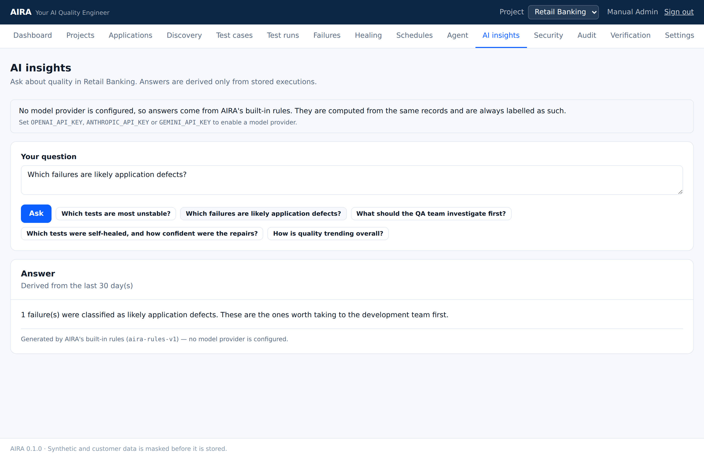

Every finding cites the records it came from and carries a confidence. When the evidence does
not support an answer, it says so instead of producing a confident paragraph from nothing.

As everywhere else, with no model provider configured the answers come from built-in rules
over the same records, and the page tells you so before you ask.

---

## 13. The Verification Center

**Verification** shows what the platform's own golden test suite found the last time it ran —
AIRA tested against purpose-built applications with known answers.

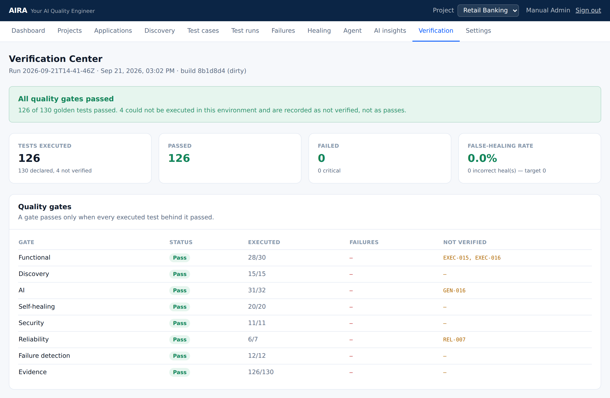

Three things to read:

- **The banner** is green only when every gate passed *and* no critical test failed. The page
  re-checks the gates itself rather than trusting the report's own verdict.
- **Not verified** is its own outcome, counted separately from passes. A test that could not
  run here — a browser that is not installed, a model provider that is not configured — is
  never counted as one that passed.
- **False-healing rate** is the headline number, kept separate from any success rate, because
  a healer that repairs nine locators correctly and silently clicks the wrong button once is
  worse than one that repairs nothing.

Populate it by running `./scripts/verify-product` on the machine. Until then the page tells
you nothing has been verified — which is not the same as everything passing, and it does not
pretend otherwise.

**The security capability is verified separately**, because verifying it means running the
scanner against a purpose-built vulnerable lab with known answers:

```bash
./scripts/verify-security                  # everything, including AIRA's own security
./scripts/verify-security --no-platform    # the lab only; no database or API needed
```

It writes `verification/reports/SECURITY-VERIFICATION-REPORT.md` and
`SECURITY-TRACEABILITY.md`, and exits non-zero if any suite failed or any security requirement
is unverified. That report declares what is NOT VERIFIED as prominently as what passed — the
permitted production path among them. What the script proves is that AIRA's security *testing*
works. It is not a statement about the security of anything.

---

## 14. Settings: people, providers and quality gates

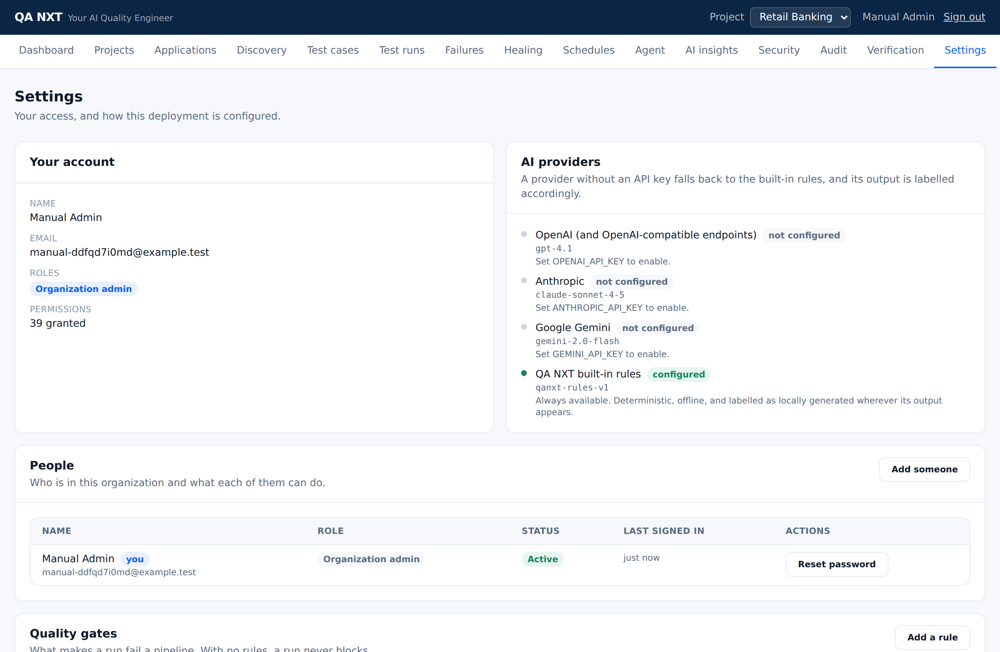

### Your account and roles

Your role decides what you can do, and it is **enforced on the server** — the console hiding
a button is a convenience, not the control.

Security is six separate permissions rather than one, because the acts differ: `security:read`,
`security:scan` and `security:triage` sit with QA leads and above; `security:scan:destructive`
and `security:authorize` with project admins; `security:production` is organization-level.
**None of them is in the Viewer set** — a security finding is a working description of how to
break the application, and read access to test results is not a reason to hold one. Holding
`security:scan` does not imply the destructive one, and a scope permitting destructive testing
does not grant the permission: both are required and neither implies the other.

### People

**Add someone** invites a colleague and gives you a one-time password to pass on. You can
change a role, disable an account or reset a password from here. Each of those ends any
session that person already holds **immediately**, not when their token happens to expire.

### AI providers

Shows each provider and whether a key is configured. **AIRA built-in rules** is always
available, needs no key, works offline, and is labelled wherever its output appears. Set
`OPENAI_API_KEY`, `ANTHROPIC_API_KEY` or `GEMINI_API_KEY` and restart to use a hosted model.

### Quality gates

Rules that decide whether a run should block a pipeline — a minimum pass rate, a ceiling on
failures, and so on. **With no rules configured, a run never blocks.** Changing a gate needs
an explicit permission, because weakening one is a release decision rather than a setting.

---

## 15. Running from a pipeline

The `aira` CLI starts a run, waits for its verdict, and writes reports your CI system can
display.

```bash
export AIRA_API_URL=http://localhost:5080
export AIRA_TOKEN=…                      # created once with: aira login --show-token

aira run --project "$PROJECT_ID" --suite "$SUITE_ID" --report-dir ./reports
```

`--suite` and `--project` take ids, not names. `--test` runs a single test and can be
repeated. `--report-dir` writes all three reports; `--junit`, `--json` and `--html` write
them individually. `--no-wait` queues the run and exits, for pipelines that collect results
in a later stage with `aira report <run-id>`.

The exit code is the part a pipeline should key off, because it distinguishes things that
need different responses:

| Code | Name | Meaning |
| --- | --- | --- |
| `0` | `PASS` | Tests passed and the quality gate passed |
| `1` | `TEST_FAILURE` | One or more tests failed |
| `2` | `QUALITY_GATE_FAILURE` | Every test was within tolerance; a gate rule blocked |
| `3` | `CONFIGURATION_ERROR` | Bad usage, or a project or environment that does not exist |
| `4` | `AUTHENTICATION_ERROR` | Not signed in, expired, or not permitted |
| `5` | `INFRASTRUCTURE_ERROR` | The platform, queue, worker or target could not be reached. **Nothing is known about quality** |
| `6` | `SECURITY_POLICY_VIOLATION` | A security policy refused the request. Read why before retrying; do not widen permissions |
| `7` | `HUMAN_REVIEW_REQUIRED` | The gate returned REVIEW. Not a pass, not a failure |
| `8` | `AIRA_INTERNAL_ERROR` | AIRA itself failed — a bug in the tool, not a finding about the application |

A **healed** or **flaky** result maps to a JUnit pass *with a note*, never a silent one. A
**blocked** result maps to `<error>` rather than a failure, because the test never ran —
calling it a pass would claim coverage that does not exist, and calling it a failure would
send someone hunting a defect that is not there.

### Security in a pipeline

The same CLI runs the security side, against an application that has been authorized (§10):

```bash
aira security scan --application-id "$APP_ID" --wait     # queue one and wait for the worker
aira security gate --scan-id "$SCAN_ID"                  # the one a pipeline keys off
aira security findings --application-id "$APP_ID" --status confirmed
```

`aira security gate` exits `0` on PASS, `2` on FAIL and `7` on REVIEW. **A build that was never
scanned exits `7`, never `0`** — "no scan ran" and "a scan ran and found nothing" are different
facts, and the CLI will not report the first as the second. The summary says so in its first two
words: `NOT SCANNED`.

The pattern that works is two cadences. On every pull request, the `regression` profile against
the QA environment — fast, and it catches the thing that matters most, a flaw that was fixed
coming back. Nightly or weekly, the `standard` profile with the full check set, which is where
new findings come from.

To narrow a pull-request scan to what the change actually touched:

```bash
git diff --name-only origin/main... \
  | aira security impact --application-id "$APP_ID" --project-id "$PROJECT_ID" --changed -
```

Two things stop that from becoming a way to pass by scanning less: a check covering a currently
open finding stays selected whatever the diff touched, and the result still reports the **full**
implied check set as the denominator — so a narrowed scan reaches the gate as partial coverage
and comes back REVIEW. Narrowing changes what runs; it cannot change what a clean result is
allowed to claim.

Give the CI account the narrowest role that can start runs and read results. It should not
be able to change quality gates: a pipeline that can relax its own gate is not a gate. The same
applies twice over to security: a CI account should not hold `security:authorize`,
`security:scan:destructive` or `security:production`.

`docs/ci-cd.md` has the full reference, including the GitHub Actions and Azure Pipelines
definitions; `docs/security/running-a-scan.md` has the security workflow.

---

## 16. Glossary

| Term | Meaning |
| --- | --- |
| **Application** | A web application registered for testing, with its URL, credentials and bounds. |
| **Discovery** | The crawl that builds the model of an application. |
| **Model / application map** | What discovery learned: pages, elements, transitions, API calls. |
| **Test case** | A sequence of steps and assertions. Generated, recorded or edited. |
| **Test run** | One execution of a set of test cases. |
| **Execution** | One test case running once, with its evidence. |
| **Evidence** | Screenshots, video, trace, DOM snapshot, console and network logs. |
| **Healing** | Replacing a locator that stopped matching with one that reaches the same element. |
| **Quality gate** | A rule that decides whether a run blocks a pipeline. |
| **Blocked** | A run that never happened. Distinct from failed. |
| **Not verified** | A check that could not be performed here. Distinct from passed. |
| **Security scope** | The written record of who authorized security testing of an application, and exactly what they authorized. Nothing is scannable without one. |
| **Security scan** | One execution of a set of security checks against an application, under a profile. |
| **Profile** | What a scan is permitted to attempt: `passive`, `standard`, `regression` or `deep`. |
| **Finding** | Something a check observed, with the request and response that establish it. |
| **Severity** | Computed from five stored factors, never assigned by a person or a model. |
| **Confidence** | How well established a finding is. Kept separate from severity on purpose. |
| **Regression (security)** | A finding that was resolved and has come back. Fails the gate at any severity. |
| **Attack surface** | What discovery walked, and which checks each part of it implies. |
| **Untested** | Nothing looked at it. Distinct from clean, everywhere in the product. |

---

## 17. What AIRA will not do

Worth knowing before you rely on it:

- **It does not decide that a failure is acceptable.** It classifies and explains; closing a
  failure is yours.
- **It does not change your tests on its own.** A healed run leaves the stored test exactly
  as you wrote it; approving the proposal is what changes it.
- **It does not test what it cannot reach.** Anything outside an application's allowed
  domains is refused, and the run says `blocked` with the reason.
- **It does not take instructions from the application under test.** Text on a page is data.
  A page that says "ignore your instructions" is treated as content, never as a command.
- **It does not invent numbers.** Every figure on the dashboard is computed from stored
  executions. Where there is nothing to compute from, it says so.

On the security side specifically:

- **It does not test an application nobody authorized.** No scope, no scan — and an empty
  allowlist permits nothing rather than everything.
- **It does not perform destructive testing, load testing or production scanning by default.**
  Each needs its own permission held by a person, and an unattended scan holds none of them.
- **It does not reach cloud metadata or link-local addresses.** Those are refused before the
  allowlist is consulted, so a scope cannot opt in to them.
- **It does not record a finding it cannot show you.** A finding arriving with no request and
  response behind it is refused rather than stored, and secrets are redacted from the evidence.
- **It does not let a model decide a severity**, or treat an AI-generated hypothesis as a
  finding.
- **It does not let anything automated close a security finding.** Self-healing cannot touch
  one, and a suppression needs a written reason and a name or the gate counts it as open.
- **It does not go green because nobody scanned.** A build with no scan is REVIEW, never PASS.
- **It does not say an application is secure**, or that it has no vulnerabilities. The
  strongest sentence it has is that within the configured scope and test coverage, no findings
  were detected by the tests that were executed — always printed with what was not tested.

---

## About these screenshots

Every image in this manual was captured by `test-lab/scripts/capture-user-manual.mjs`, which
seeds a realistic workspace — a project, an application, a crawl, generated tests, a run that
passes, a run that fails, a healing proposal, an agent pass and an authorized security scan —
and then drives a real browser through the real console to photograph each screen.

Each screenshot must prove its own caption before it is taken: the script waits for the
content the caption describes and **fails** if it never appears. An earlier version without
that check produced a screenshot of an empty agent page under a caption about an agent's
report, which is the kind of quiet wrongness this product exists to object to.

Regenerate them against your own installation:

```bash
node test-lab/scripts/capture-user-manual.mjs
```

The data in them is synthetic. The demo bank's customers, balances and transactions are
generated from a fixed seed; no real data of any kind appears in this manual. The security
findings are real findings against that demo bank, produced by a real scan under a scope
written for it — the authorization note names a person who does not exist, for an application
that exists only to be tested.
